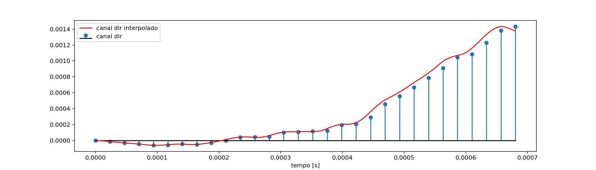
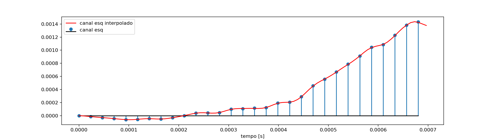
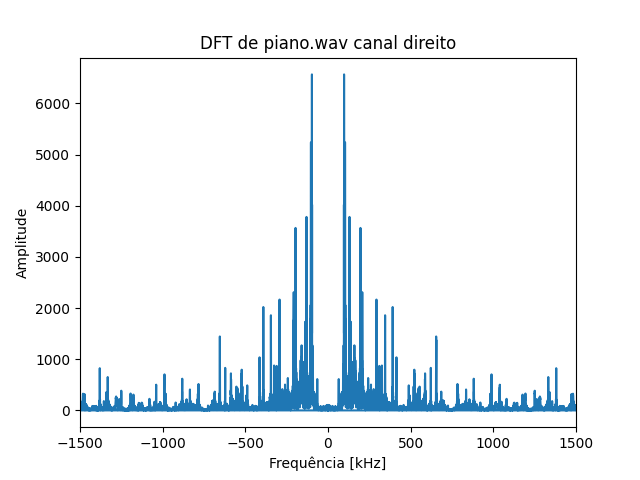

# Processamento digital de sinais - Projeto final: Filtro passa baixas FIR para processamento de sinal de audio

Pós realização do download de um arquivo de áudio em https://freesound.org/browse/. Utilizando a linguagem Python, foram realizados os seguintes passos:

1. (a) Plote o sinal no domínio do tempo.

2. (b) Usando a transformada rápida de Fourier (FFT), de alguma biblioteca de Python, plote o espectro de
frequências do sinal para as primeiras N amostras. Use um valor de N adequado. Escalone o eixo de
frequências das N amostras da FFT de forma adequada.

3. (c) Utilizando os conceitos de mudança de taxa de amostragem vistos em aula, interpole o sinal por um fator L = 3;
    - (c.1) Fazendo uso da biblioteca pyFDA, projete um filtro passa-baixas digital, com resposta ao impulso finita (FIR), adequado para a interpolação por L = 3;
    - (c.2) Com os coeficientes do filtro projetado, filtre o sinal. Implemente a filtragem com a operação de convolução no domínio da frequência, fazendo uso de funções FFT e IFFT (utilize o método de sobreposição e soma ou sobreposição e armazenamento);

4. (d) Plote os conteúdos temporais e espectrais do sinal original, do sinal após a expansão e após a interpolação. (O conteúdo espectral pode ser plotado com funções que implementem a FFT ou com a função welch.)

## Execute

```bash
python main.py # or python3 main.py
```

## Coeficientes do filtro utilizado

- [Coeficientes](./coefficients/coeffk.csv)
- Ferramenta [PyFDA](https://github.com/chipmuenk/pyFDA) utilizada

## Audio

Obtido em (freesound.org)[https://freesound.org/browse/].

### Original

<audio src="./piano.wav" controls preload></audio>

### Pós interpolação

<audio src="./piano_interp_L3.wav" controls preload></audio>

## Gráficos obtidos

|    |    |
|----|----|
|  |  |
|  |  |
|  |  |
|  |  |
|  |  |
|  |  |
|  |  |
|  |  |
|  | |


